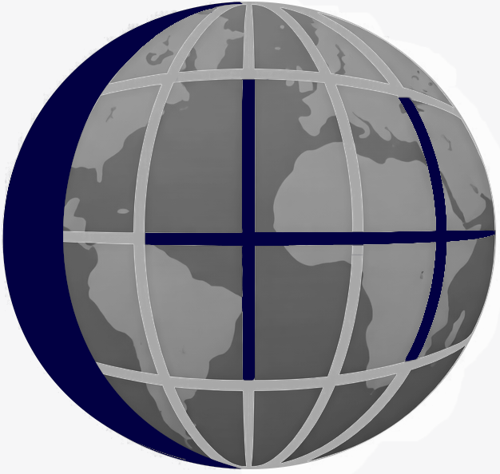
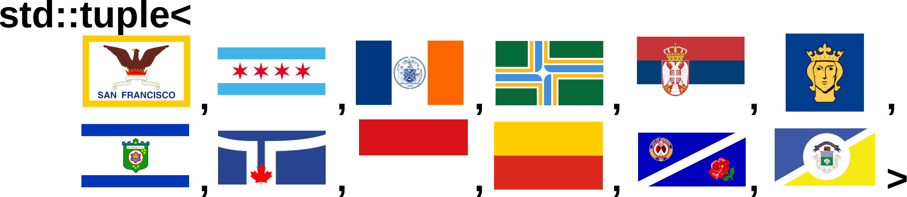

<link rel="icon" type="image/png" href="/favicon-96x96.png" sizes="96x96" />
<link rel="icon" type="image/svg+xml" href="/favicon.svg" />
<link rel="shortcut icon" href="/favicon.ico" />
<link rel="apple-touch-icon" sizes="180x180" href="/apple-touch-icon.png" />
<meta name="apple-mobile-web-app-title" content="GlobalCpp" />
<link rel="manifest" href="/site.webmanifest" />

 

Welcome to the landing page for GlobalCpp, a collaboration between numerous regional C++ User Groups.
Very much new and very much under construction. Please join us on this endeavor!

Join us for our weekly online tech presentations Saturdays at 11 am CT, 12 pm ET. This Saturday we will be presenting to Zoom as last week, but will also try streaming directly to YouTube live.
* [Zoom Link](https://zoom.us/j/92959855550?pwd=ezV5fKWy9I29Fb8ag1DhabvJmS92I5.1)
* [YouTube live](https://www.youtube.com/@GlobalCpp)
* The Zoom presentation is highly locked down. Please join on the [Chicago C++ Discord Server](https://discord.gg/HVv7Jya37T) to ask questions while we work on a more permanent home for discourse. 
* [Google Calendar](https://calendar.google.com/calendar/u/0?cid=NDdjMjI1ZTAyYTFkNjdkNWNmZjVhY2EzMDk1YjMzMWEyODRlZDQ4ZTQ4YTlkZDAxMTYyODJhYjEzZGM0MmQ3MEBncm91cC5jYWxlbmRhci5nb29nbGUuY29t) for upcoming presentations

Pending volunteer efforts, videos should be available same day at our [YouTube channel](https://www.youtube.com/@GlobalCpp)

Please also check out our individual user groups:
* [Bay Area](https://www.meetup.com/cpp-bay-area/)
* [Chicago Meetup](https://www.meetup.com/Chicago-C-CPP-Users-Group), [Chicago Info Page](https://chicagocpp.github.io/)
* [New York](https://www.meetup.com/new-york-c-c-meetup-group)
* [Portland](https://www.meetup.com/pdxcpp/)
* [Toronto](https://www.meetup.com/cpptoronto/)

And don't forget to check out this year's conferences:
* [NDC {Toronto}](https://ndctoronto.com/) : May 5-8 Toronto, CA : Check the discord server (in channel more-cpp) for discount code
* [Cppcon 2026](https://cppcon.org/) : Sept 12-18 Aurora, CO

# Session Presenters and Topics

## Coming Soon

* 2026/01/24 : [Rob Douglas](presenters/robert_douglas.md) - Combining some C++17 and later features for elegance
* 2026/01/31 : [Victor Eijkhout](presenters/victor_eijkhout.md) - Parallelism through OpenMP (in C++, of course)
* 2026/02/07 : [Matt Godbolt](presenters/matt_godbolt.md) - Advent of Code Omnibus

## Past Presentations

* 2026/01/17 : [Rob Douglas](presenters/robert_douglas.md) - 2 topics, Conda and Type Erasure

# Upcoming in-person social events near you!

## This Week

* 2026/01/20 : Franklin Tap in the Chicago Loop [RSVP](https://www.meetup.com/chicago-c-cpp-users-group/events/312918072/)
* 2026/01/20 : Lucky Labrador Brew Pub, Portland, OR [RSVP](https://www.meetup.com/pdxcpp/events/312454247/)

## Soon

## Past Events
