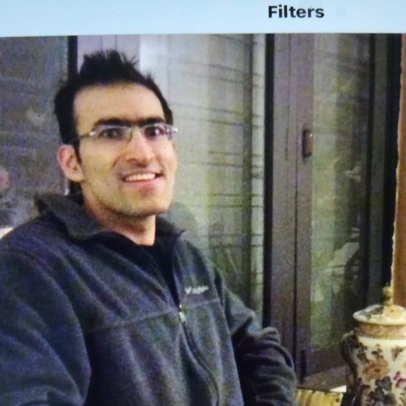

# Ahmad Sharif

Ahmad has worked at various tech companies working on projects from GPU hardware to compilers to infrastructure to application software. He is currently a pytorch contributor, trying to make GPUs go BRRR. He is passionate about reducing latency, improving throughput and debugging software slowness.

(LinkedIn)[https://www.linkedin.com/in/ahmadsharif/]

