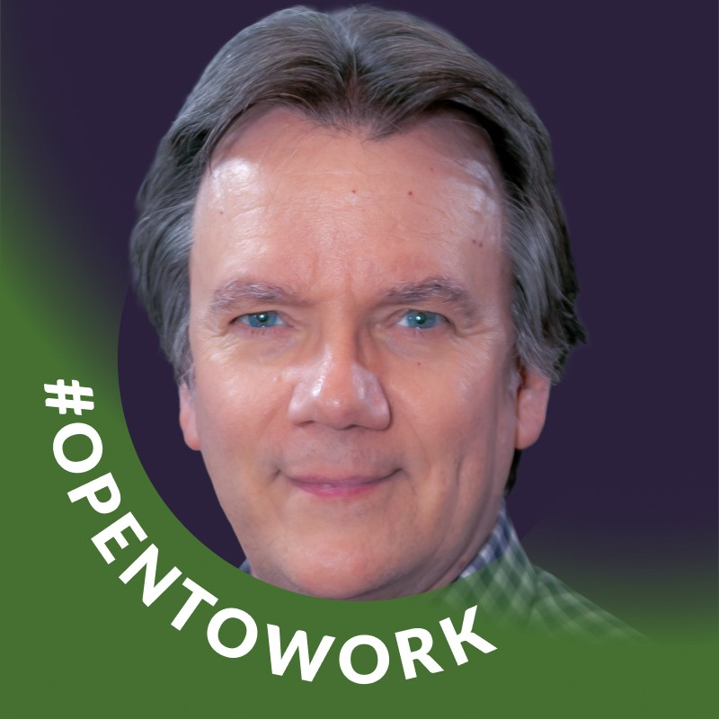

# Alan Talbot

Alan Talbot is a software architect and engineer specializing in C++. He began his career as a pioneer in professional music notation software and later built engineering platforms for GIS data production and railroad simulation. He has been a C++ programmer since 1990 and an active member of the ISO C++ committee (WG21) since 2005, and has spoken at major C++ conferences for more than ten years. His C++ contributions have focused on runtime efficiency, including container emplacement, manipulation of associative container nodes, and unrestricted unions.

