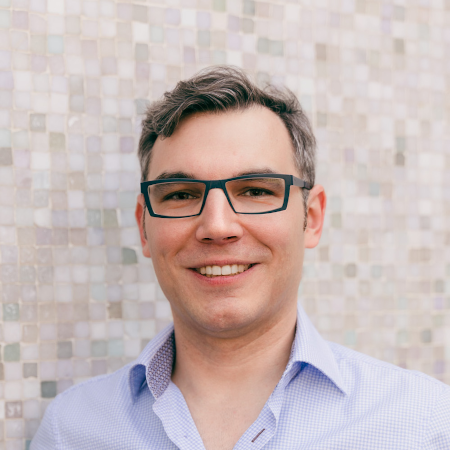

# Andreas Fertig

Andreas Fertig is an expert C++ trainer and consultant who delivers engaging and impactful training sessions, both on-site and remotely, to teams around the globe.

As an active member of the C++ standardization committee, Andreas contributes directly to shaping the future of the language. He shares insights on writing cleaner, more efficient C++ code at international conferences. He publishes specialist articles, e.g., for iX magazine, and has published several C++ textbooks.

With C++ Insights (https://cppinsights.io), Andreas has created an internationally recognized tool that enables users to look behind the scenes of C++ and thus understand constructs even better.

Discover more about Andreas and his work at andreasfertig.com.

