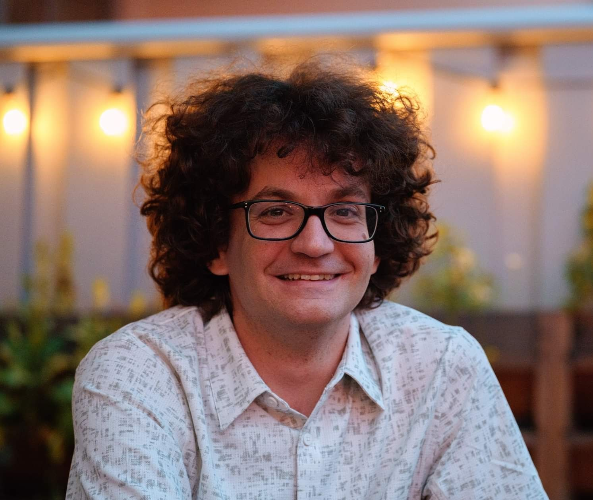

# Bryce Adelstein Lelbach

Bryce Adelstein Lelbach has spent over a decade developing programming languages, compilers, and libraries. He is passionate about parallel programming and strives to make it more accessible for everyone.

Bryce is a Principal Engineer at NVIDIA, where he founded the Core C++ Compute Libraries team and now leads the Vanguard Programming group that drives NVIDIA's roadmap for programming languages, compilers, and core libraries.

He is a leader of the systems programming language community, having served as chair of the C++ Library Evolution and the US programming language standards committee. He has been an organizer and program chair for many conferences over the years. On the C++ committee, he has worked on concurrency primitives, parallel algorithms, senders, and multidimensional arrays.

He previously worked at Lawrence Berkeley National Laboratory and Louisiana State University. He is one of the founding developers of the HPX parallel runtime system. 

Outside of work, Bryce is passionate about airplanes and watches. He lives in Midtown Manhattan with his girlfriend and dog.

