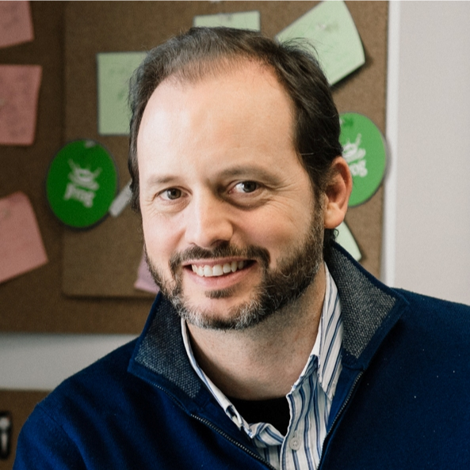

# Diego Rodriguez-Losada

Diego Rodriguez-Losada‘s passions are robotics and SW engineering and development. He has developed many years in C and C++ in the Industrial, Robotics and AI fields. Diego was also a University (tenure track) professor and robotics researcher for 8 years, till 2012, when he quit academia to try to build a C/C++ dependency manager and co-founded a startup. Since then he mostly develops in Python. Diego is a conan.io C/C++ package manager co-creator and maintainer, now working at JFrog as Conan Lead Architect and C/C++ Advocate. 

