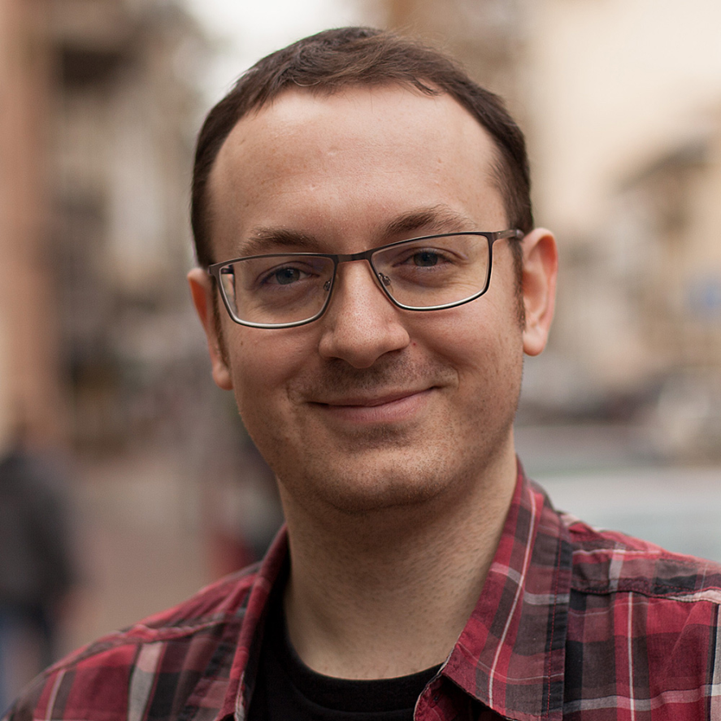

# Dušan Jovanović

Dušan Jovanović is a C++ engineer, systems architect, and co-founder of [Inceptive](https://inceptive.io/), where he builds ultra-low-latency exchange technology. He has more than a decade of professional experience in C++, with a background in high-performance systems, device drivers, and low-level engineering. Dušan is also a co-founder of C++ Serbia, where he contributes to the community through meetups, mentoring, and talks.

[Organizer for Serbia C++](https://www.meetup.com/cpp-serbia/)

[LinkedIn](https://www.linkedin.com/in/duxi90/)

