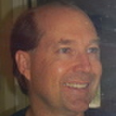

# Jeff Garland

Jeff Garland is a software developer from Flagstaff Az and spends an unreasonble amount of time on C++.  He's currently the Vice-Convenor, a member of the Directions Group, and vice-chair of the Library Working Group.  He's also the co-founder of and lead of [The Beman Project](https://bemanproject.org/)
 - dedicated to bring tomorrow's standards libraries today.  To keep his sanity he's often hiking or biking in the Arizona mountains and canyons.

