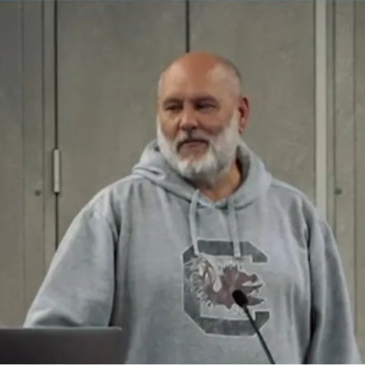

# Jody Hagins

Jody is a C++ developer at LSEG with 30-plus years in the low-latency and high-frequency trading trenches: feed handlers, matching engines, and the kind of Unix kernel work that makes people back away slowly at parties. These days he builds production C++ without typing the code himself, and he has strong, hard-won opinions about how that actually goes. He runs several AI++ workshops in the C++ community and is still, at heart, a football coach who happens to write software.
