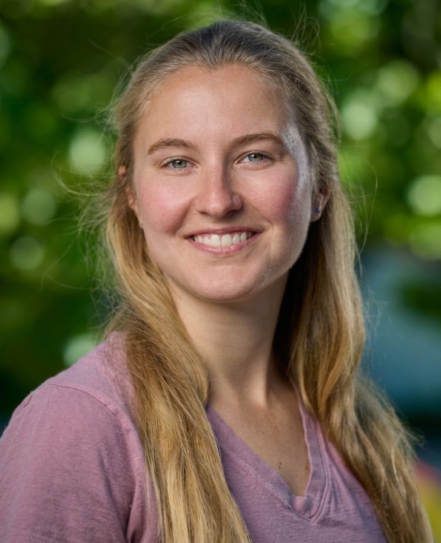

# Kristi Belcher

Kristi is a Software Developer at Lawrence Livermore National Laboratory working primarily on Umpire, an open source library that supports parallel data and memory management on HPC platforms. She also works on the RADIUSS project which promotes adoption of LLNL open source libraries, HPC education, and the development of shared infrastructures. Additionally, she is a Group Leader where she helps her group members navigate their careers. Her interest areas include open source software, GPU programming, parallel programming, and HPC memory management.

