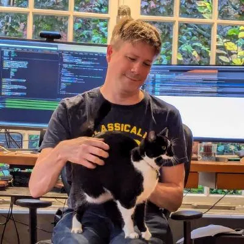

# Matt Godbolt 

Matt is a C++ programmer and occasional verb. He loves writing efficient code 
and sharing his passion about how computers work under the hood. He works on 
cool and interesting high performance stuff at Hudson River Trading. He has 
been in finance for 15 years but has worked on mobile apps at Google, run a 
C++ tools company and spent more than a decade making console games. When not 
tinkering on [Compiler Explorer](https://www.godbolt.org), Matt enjoys 
working on emulators for old 8-bit computer hardware, and being one half of 
the programming podcast [Two's Complement](https://twoscomplement.org/)

