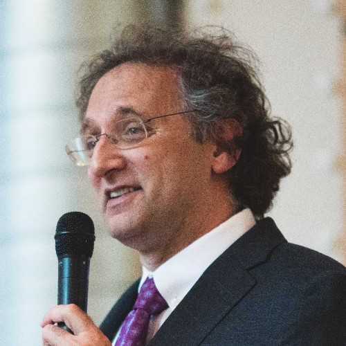

# Mike Spertus

Michael Spertus is the CTO of Enklu building out AR technologies in Chicago, as well as a Full Adjunct Professor of Computer Science at the University of Chicago.

Before joining Enklu, Michael was a Senior Principal Engineer in Amazon's Development Tools group, putting C++ in the cloud. Prior to this, he was a Fellow, VP at Symantec, the world’s largest Cybersecurity firm, where he led the development of a wide array of cybersecurity technologies including a major anti-rootkit technology now protecting over one hundred million computers and Symantec’s Authoritative Data Lake, one of the world’s largest security data lakes that was use to discover the Russian Dragonfly attack on the US energy grid.

Mike has been involved with programming languages since the 1980s when he helped write one of the first commercial C compilers for the original IBM PC and is a long-time member of the ANSI/ISO C++ Standards Committee, where he has contributed over 50 standards proposals, several of which are now important parts of the C++ language. He has spoken frequently in both Academic and Industry settings, including Invited Keynotes at the Shanghai and Beijing C++ Summits, Best Poster award at CPPCon 2017, and many others. He is a member of the board of directors at the [Spertus Institute](https://www.spertus.edu/).

[LinkedIn](https://www.linkedin.com/in/mike-spertus-9b7324/)

