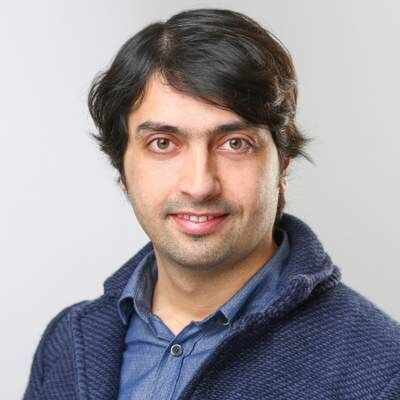

# Mouaz Chamieh

Mouaz Chamieh is a software architect with over 12 years of professional experience. He holds academic degrees in computer science and has a strong background in C++, software architecture, and adherence to industry coding standards. He is passionate about patterns and best practices which deliver clean designed/coded, testable, maintainable, scalable, secure, and high-performance software.

