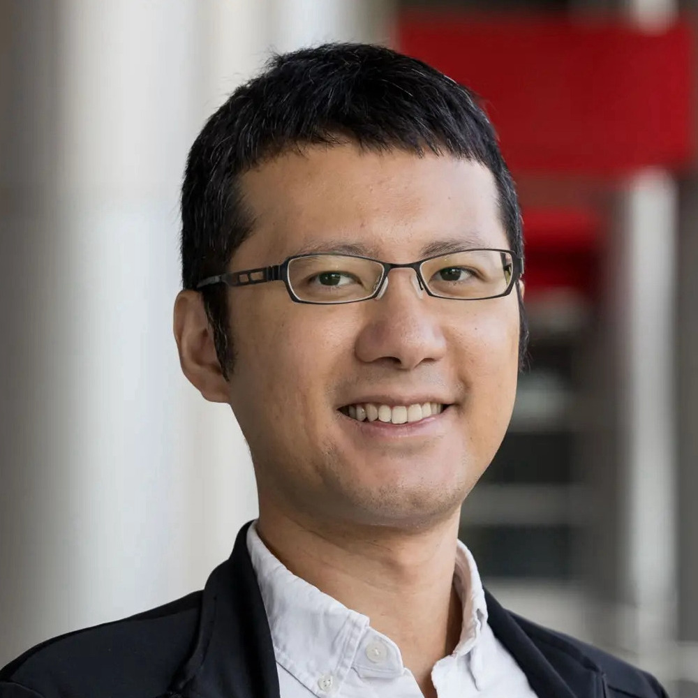

# Tsung-Wei Huang

Dr. Huang is an Associate Professor in ECE at the University of Wisconsin-Madison (UW-Madison), with an affiliate appointment in CS. Previously, he was an Assistant Professor at UW-Madison (2023–2025) and University of Utah (2019–2023). He earned his PhD in ECE from UIUC and BS/MS in CS from Taiwan’s NCKU. His research focuses on building software systems for performance-critical applications, including CAD, machine learning, and quantum computing. His tools, such as Taskflow and OpenTimer, are widely used in industry and academia.

